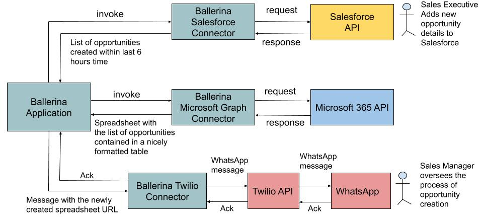

# ipass-benchmarks
A Ballerina application which populates a Microsoft 365 spreadsheet with data queried from Salesforce and sends the updated spreadsheet's URL via a WhatsApp message.

Figure 1: System architecture of integration application showing the interaction between the Ballerina software components and the external parties
